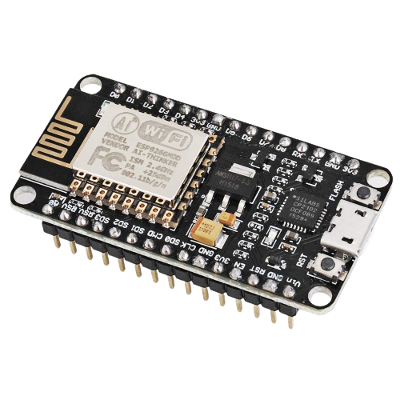
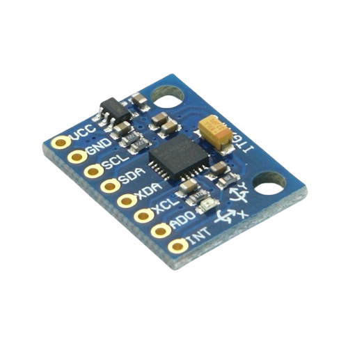
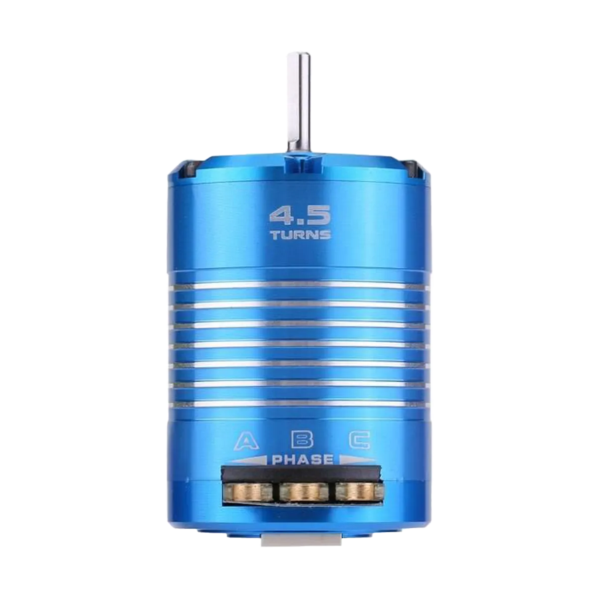
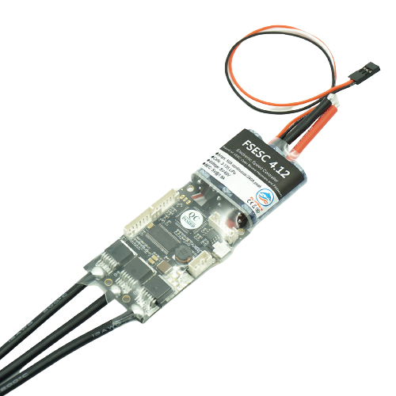

# Components Used

In this section, we will list the components we used and the reason for choosing them. 

## List of Components

1. 1x NodeMCU esp8266
2. 1x MPU6050 Gyroscope and Accelerometer Module
3. 2x Dilwe 540 Sensored Brushless DC Motor
4. 2x FSESC 4.12 50A Motor Driver
5. 2x GT2 9mm width, 700mm long toothed belt
6. 2x 1m long, M8 threaded rod
7. 11x M8 bolts, washers, O-rings and nuts for the structure of the robot
6. 16x M6 bolts and nuts for increasing the moment of inertia of the reaction wheel
8. 4x M3 "Grub" screws for the motor coupler 
9. Zipties, elastic bands, double sided tape and velcro

## NodeMCU esp8266

We chose to use the NodeMCU esp8266 for various reasons. First and foremost, the NodeMCU has a maximal clock speed of 160 MHz. In comparison to the Arduino Uno's 16 MHz, the NodeMCU is extremely fast. This suits our robot well, since for it to balance, it must react as quickly as possible. Moreover, the NodeMCU has a WiFi card embedded on it. This is really convenient for tunning the PID parameters, as it allows us to avoid flashing the nodeMCU every time we change change the parameters. 

## MPU6050 Gyroscope and Accelerometer

The MPU6050 is a cheap and readily available gyroscope and accelerometer. It comes with a built-in DMP processor that allows for the fusion of the gyroscope and accelerometer data for obtaining the roll/pitch/yaw of the sensor. As we will discuss in the [Challenges](/docs/process/challenges.md) section, it was not easy to get it to work properly from the beginning, so be sure to check that part out. 

## Dilwe 540 Sensored Brushless DC Motor

This motor was an excellent choice for our robot for the following reasons. It is posses hall sensors that help the ESC to accurately control it and have enough torque at startup. It has a maximum RPM of 540 and a horsepower of 490 Watts. Not only that, but it also sells at a very reasonable price. With such a motor, we were able to build a robot that is powerful enough to straighten itself up from an almost horizontal position. 

## FSESC 4.12 50A Motor Driver

The FSESC 4.12 is an excellent motor driver that is often used in electric skateboards, bikes and many more applications. It ships with a [software](https://vesc-project.com/vesc_tool) to extensively tune the behavior of the ESC. Moreover, it is possible to connect the motor's hall sensors to it, allowing for very precise control at all speeds.
