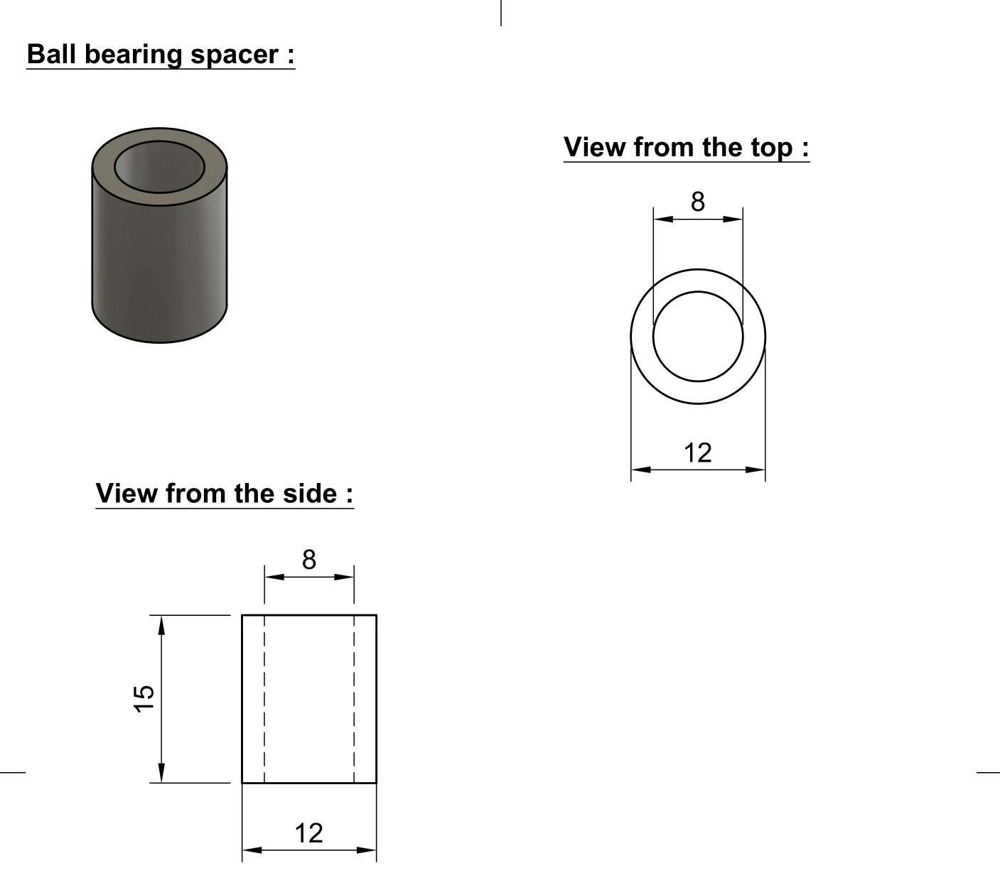
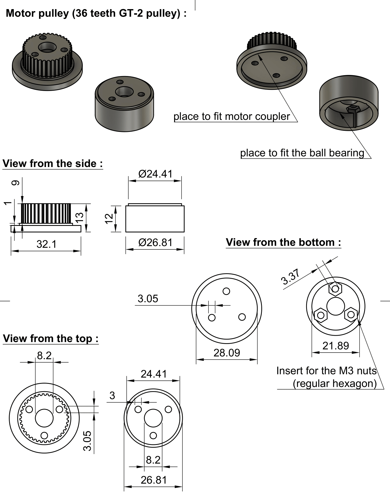

# **Manufacturing**

## **Preliminaries** 

In this section you will find the information related to the realization of the 3D designs,the specification about the printing of our parts and the blueprints of the parts. This section will be separated in **3 parts** : the first presenting the parts that can be used for both one and two axis, then the parts specific to the one axis design and finally the parts for the two axis model. For the designs we used **Fusion 360** and **Prusa 3D printers**. Note that every dimension reported on the blueprint are given in **millimeters (mm)**.

1. **Common parts**

    - 1.1 The reaction wheel and the spacers
    - 1.2 The teethed pulley
    - 1.3 The motor coupler
    - 1.4 The motor pulley

2. **First prototype**
    - 2.1 Main platform
    - 2.2 Motor shaft holder
    - 2.3 Reaction wheel holder

=======

1.   **How to design a GT-2 pulley with Fusion 360**

2. **Common parts :**

    - 2.1 The reaction wheel and the spacers

    - 2.2 The teethed pulley

    - 2.3 The motor coupler

    - 2.4 The motor pulley

3. **First prototype**
    - 3.1 Main platform

    - 3.2 Motor shaft holder

    - 3.3 Reaction wheel holder

4. **Second prototype :** 
    - 4.1 Main platform
    - 4.1 Main platform

    - 4.2 The Stick 

    - 4.3 the motor support

    - 4.4 the reaction wheel holder 

## **how to design a GT-2 parametric design of a pulley**

 * **What is a GT-2 pulley ?**

A GT-2 pulley is a type of standard for belts and pulleys, it is defined mostly by the pitch of the teeth and the distance between the edges of two teeth. Here's the description of the parameters we're interested in for designing the teethed pulley.

* the parameter R1 correspond to the inner pitch of the teeth of our pulley, we can think about it as if we small circles of this diameter at the same position at both side of one of the pulley's teeth.

* the parameter R3 correspond to the tooth radius, in the case of the design of the pulley.

* The parameter P is really important since it is the distance between two teeth (**in mm**). Therefore the diameter is defined by : $$D = \frac{(P*N)}{Pi} $$

    $N$ : The number of teeth (**must** be an integer),

    $D$ : The diameter,

    $P$ : The the distance between two teeth, given by the standards of the pulleys

If we still want to be able to "choose" the diameter, then with basic algebra find the number of teeth needed for the desired diameter:

$$ N = \frac{D \pi}{P}$$

**To create a parametric design for a GT2 pulley, you can refer to the video tutorial mentioned. It provides a helpful guide to follow and assists in achieving the desired outcome :**
**To create a parametric design for a GT2 pulley, you can refer to the video tutorial mentioned. It provides a helpful guide to follow and assists in achieving the desired outcome :**

  <iframe width="560" height="315" src="https://www.youtube.com/embed/PDNIiLSTzG4" frameborder="0" allow="autoplay; encrypted-media" allowfullscreen></iframe>

  <iframe width="560" height="315" src="https://www.youtube.com/embed/PDNIiLSTzG4" frameborder="0" allow="autoplay; encrypted-media" allowfullscreen></iframe>

## **2. Common parts**

### **2.1 The reaction wheel and the spacers**

* **The reaction wheel**

In order to achieve the maximum moment of inertia for the reaction wheel, our objective was to maximize the diameter of the wheel. Since the moment of inertia is the sum of the squared distances to the mass, the farther the mass is from the axis, the larger the moment will be. However, we faced a constraint due to the size of the printing bed of the printer we used for the distance to the axis.

Our experimentation demonstrated that a wheel with a thin design could easily break if the model were to fall. This is why the model we have implemented here is highly robust and should not break, provided it is used correctly in the application of this project. **Note that the reaction wheel has 32 holes for the screws used to add weight far from the axis.**

The most crucial aspect of printing this part is to use an appropriate perimeter setting. Increasing the perimeter setting enables us to reinforce the piece without significantly increasing the infill. It is essential for the holes where we will insert screws, nuts, and the location where the ball bearing will be placed to be sufficiently strong. This ensures that they do not break during rotation or when inserting the ball bearing. Here we used a perimeter of 4 and an infill of :

* **The spacers**

As you can observe in the section explaining the assembly of the model, we needed spacers with the same inner diameter as the ball bearing to ensure a good fit between the ball bearings.

The accompanying design picture, illustrates the dimensions of one of these spacers. **Please note that we used spacers of various sizes, because the length of those depend on the number of spacing plates used, but we are presenting only one blueprint as the only difference lies in the height of the spacers. We used 9mm spacers, but since it's really small parts you can try to print different sized spacers.**

* **The spacing plates :** 

In order to avoid that the belt hits the nuts from the reaction wheel while working, we needed spacer plates to increase the distance between the teethed pulley therefore we designed the spacing plates here bellow is the design and the dimensions of those spacers. we use 2 of them in the model but if needed you try to use more.

In order to avoid that the belt hits the nuts from the reaction wheel while working, we needed spacer plates to increase the distance between the teethed pulley therefore we designed the spacing plates here bellow is the design and the dimensions of those spacers. we use 2 of them in the model but if needed you try to use more.

### **2.2. The teethed pulley**

We used GT-2 belts, which necessitated the design of GT-2 pulleys. To achieve this, we employed a functionality in **Fusion 360** that enabled us to create parametric designs of the pulleys. This approach facilitated the rapid design of the desired pulley variations and also facilitated testing different gear reduction options. The creation of this design is explained step by steps just bellow

The GT-2 pulley follows a specific standard for the teeth, which includes the pitch of the teeth on the pulleys and belts. Therefore, the parametric design of **the pulley size depend on the desired number of teeth**. In our specific application, the number of teeth required is determined by the desired gear reduction.

For this particular printing, the most important setting to consider is the **precision**. Given that we are printing pulleys with small teeth, it is essential for the printing to be as accurate and precise as possible. Here we used the option : **10mm Quality** preset from **Prusa Slicer**. To prevent the belt to skip, we need plates to help the belt stay straight in on the pulley, here's the blueprint of those plates : 

### **2.3. Motor coupler**

For the motor coupler, we machined them using the tools available to us. This approach enabled us to create a high-quality coupler specifically designed for the motor we had. We were unable to find any suitable couplers for purchase online that could be delivered within a reasonable time frame, which is why we resorted to machining our own. Here's the blueprint we created for this coupler

### **2.4. The motor pulley :**

To do the gear reduction we wanted we needed to fix a small teethed pulley to the motor coupler. We needed this pulley to be small enough to avoid printing enormous pulley if we wanted to modify the gears reduction. Increasing the reduction means modifying the height of the reaction wheel it could also mean buying new belts if the diameter of the pulley is too big. The minimum diameter of the pulley (which is in fact a constraint on the number of teeth) is limited by the screws holes position of the motor coupler. 

### **3.1 One axis bottom :**

As the first prototype purpose is to balance in one axis of freedom, we needed a plate where we could fit the motor, the ESC, the breadboard and the esp8266. **Note that for the first prototype we did all the tests without the battery mounted.**

We printed this part only in PETG and glued some rubber on the bottom to add friction, but if we had had more time we would have printed this as a composite of two materials (See in the section about the balancing stick).

### **3.2 Motor shaft support :**

The motor shaft support part serves the purpose of preventing excessive tension on the motor shaft while tensioning the belt. By using this part, we can avoid putting undue strain on the motor shaft, reducing the risk of damaging or breaking the motor. Alternatively, one can utilize a threaded rod inserted into the ball bearing of the motor pulley design to achieve the desired belt tension. This method allows for greater flexibility in adjusting the tension without concerns about motor damage.

P**lease note that for the two-axis design, we did not use a specific piece for belt tensioning. Initially, this decision was made due to space constraints. However, during testing and experimentation, we discovered that the motor shaft support was not necessary for belt tensioning. Therefore, we found that the motor shaft support could be omitted without compromising the proper tensioning of the belt.**

### **3.3 reaction wheel support :** 
 
The part here bellow is designed to hold the threaded rod to hold the reaction wheel.
   

## **4. Second prototype :**

### **4.1 Main platform :**

The design of the main plate for the two axis prototype, there were two constraint that we **had** to satisfy :

* The distance two holes separated by 144 mm (which we'll refer as : the threaded rod holes), which is the distance of the holes in the handle of this prototype. We could easily increase this distance if needed **but**, increasing this distance means that the wheel older becomes bigger and heavier, and increasing the weight at the top too much is something we want to avoid if possible.

* The place where we'll put the motors, it also depends on the threaded rods holes, since it depends on the "two axis wheel holder". This place is also constrained by the **size** of the motor, since the motors could touch each others.

The small marks located next to the inserts for the motor mount are designed to serve as indicators for the motor position. While they are not strictly mandatory, they can be useful for aligning the motors at approximately the same relative position. These marks are more of a helpful guideline rather than a strict requirement. It is up to you whether you choose to include them in the design or not. You have the flexibility to determine the spacing between two of these marks according to your preference or specific needs.

### **4.2 The Stick :**

This part is the stick that serves the purpose of balancing the model. Although the design itself is relatively simple, the printing process presents a unique aspect. We encountered an issue where balancing on a stick made solely from PETG plastic was not viable due to its lack of grip, which would complicate the balancing process. Consequently, we devised a solution to print the stick using a combination of two materials. The upper part of the stick is printed using PETG plastic, while the half sphere at the end of the stick is printed using TPU plastic. We opted for TPU plastic because it is commonly used for tire prototypes, which offers improved grip properties.

To achieve the composition of materials, we programmed a color change during the print process where we intended to switch to the TPU filament. Due to the difference in density between TPU and PETG, we had to make slight adjustments to the printer's head positioning to meet the specific requirements for printing TPU with Prusa printers.

**Note that in order to achieve a desirable texture with the TPU material, we utilized the following specific parameters (ONLY for the TPU part):**

 * Fill density : 10% 
 * Fill pattern : Gyroid
 * Bottom solid layers : 5
 * Perimeters : 2
 * Top solid layers : 4

 **Considering that this is a small print, leaving the top solid layer unaltered would have reTosulted in a denser and less flexible top portion. By modifying the top solid layer, we were able to achieve the desired level of flexibility and meet our specific requirements for the print.**

### **4.3 The Motor Support :**

The design of the motor support for this project is largely similar to the one used for the single-axis prototype. However, there are a few notable differences. Firstly, the holes used for attaching the motor support to the plate are positioned closer together in this design. Additionally, the base of the motor support is narrower. This modification was made to ensure that the wheel holder and the handle could remain compact, as increasing their size was something we aimed to avoid.

### **4.4 The reaction wheel holder :**

This part is specifically designed to securely hold the two reactions perpendicularly, while minimizing the distance between both wheels. The goal is to make the model as compact as possible. There are two designated positions for threaded rods vertically, which serve to connect this part with the main plate. Additionally, two other holes are provided for threaded rods to be inserted perpendicular to the part, enabling them to hold the reaction wheel in place.

### **4.5 The two axis handle :**

Note that this design of the handle is just the same design as the one axis one but with different size.

## Sources of the images

