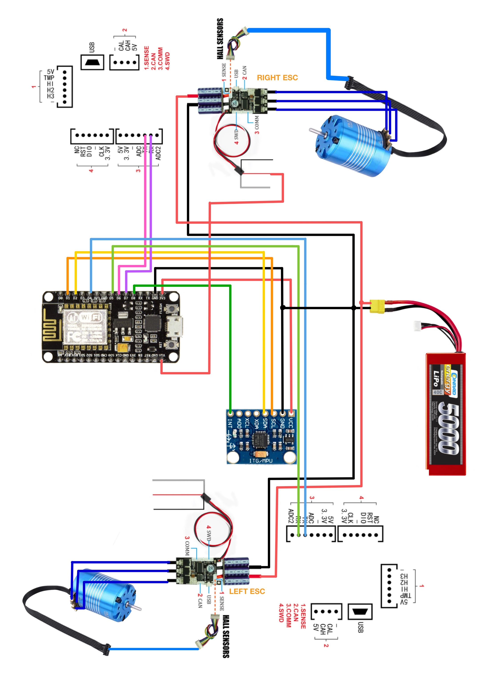

# Wiring Instructions

The wiring diagram is the following: 

The following table contains all the connections to the NodeMCU. 

| NodeMCU Pin  | Connected To |
|--------------|--------------|
| D1           | SCL MPU6050  |
| D2           | SDA MPU6050  |
| D4           | TX ESC Left  |
| D5           | RX ESC Left  |
| D6           | TX ESC RIGHT |
| D7           | RX ESC RIGHT |
| D8           | Int          |
| Vin          | 5V ESC       |
| 3v3          | VCC MPU6050  |

## Notes 

- The D1 pin and the D2 pin are reserved for SCL and SDA of the MPU6050 respectively. The D8 pin is reserved for the interrupt pin on the MPU6050. 
- The MPU6050 is powered through the 3V3 pin on the NodeMCU. 
- The NodeMCU itself is powered by the 5V red cable of the ESC. 
- All the grounds are connected together. 
- For the TX and RX channels on the ESCs, it does not matter to which digital pin they are connected on the NodeMCU. However, note that the pins used must be specified on the code. 
- Both ESCs are powered directly through the battery. 
- There is one ESC per motor and the hall sensors of each motor are connected to each ESC respectively.