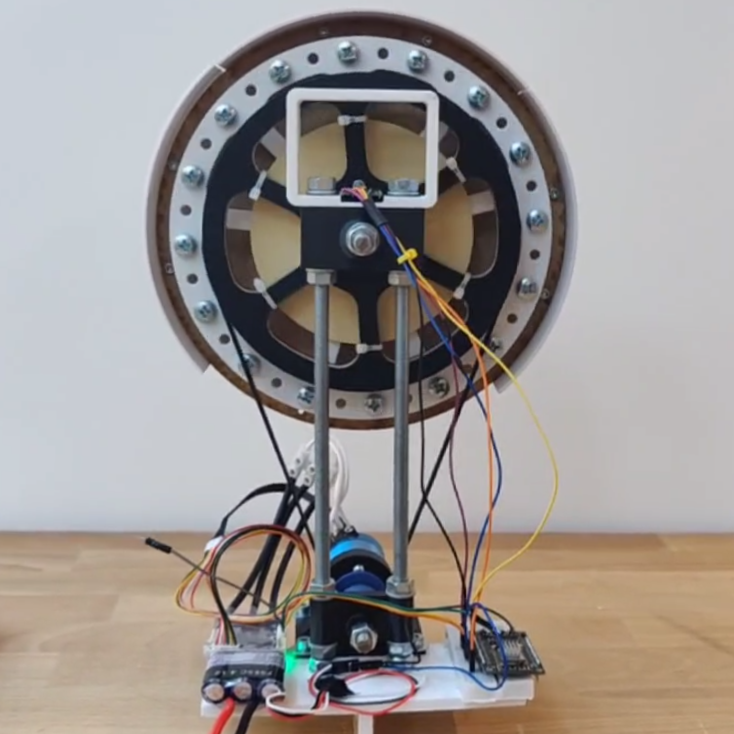
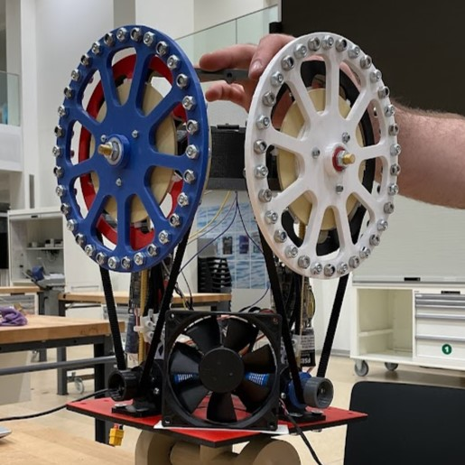

# Reaction Wheel Robot Project

## Introduction
<section class="introduction">
    Welcome to the EPFL Reaction Wheel Robot Project which was realized by a team of 5 Computer Science students during the 2023 summer semester and took 8 weeks from start to finish. 
    Through this complete documentation, we will guide you through the manufacturing and software development process of the robot.   
    You can find all of the code and the CAD designs we used here: <a href="https://github.com/mit-unicycle ">github.com/mit-unicycle</a>  
    Here are the Notion Pages we used to store information: 
        <a href="https://summer-espadrille-b76.notion.site/Items-to-buy-a39584837b4b4c01937789933fe2feb7">Items to buy</a> ,
        <a href="https://summer-espadrille-b76.notion.site/373cf709cd534d39bf88407b930a165b?v=a52da7a304df4a25abab6df019da81b1">Design</a> , 
        <a href="https://summer-espadrille-b76.notion.site/b2048f4cb776428da3f5c4c3cff9b32a?v=64331302bfdf44a6abfef367b66ab922">Setup guides</a>
</section>

## Motivation
The motivation behind the EPFL Reaction Wheel Robot Project stems from our fascination with robotic systems and the desire to explore the principles of balance and stabilization. 
By constructing a robot that relies on reaction wheels, we aim to delve into the underlying physics and engineering concepts involved in maintaining stability.

Our project presents a unique opportunity to combine theoretical knowledge with hands-on experience in robotics. 
We believe that understanding the intricate interplay between mechanics, electronics, and software is crucial 
for tackling complex real-world challenges in the field.

Furthermore, by documenting our journey, we hope to contribute to the growing body of knowledge and inspire others to explore similar projects.
We aim to provide clear instructions, explanations, and insights that empower individuals to embark on their own robotic endeavors.

## Project Description
Our goal is to build a robot that can stabilize itself using reaction wheels. 
Our original milestones were:
<ol>
    <li>Build a prototype with only one axis of freedom. It allows us to learn how to make it work and experiment.</li>
    <li>Build a prototype with 2 axis of freedom and 2 reaction wheels. It should be able to balance on a single point of contact with the ground.</li>
    <li>Add a wheel on the bottom that would allow it to move.</li>
</ol>
Although, due to issues we will discuss further, we couldn't complete all of them.
  

<section class="images">
    

        
    

    

        
    

</section>

## Technical Overview
In order to balance a such a device, we must apply real-time corrections to the tilt of the system. How are we going to produce the necessary force required to stabilize the robot? 

The answer is by using reaction wheels. A reaction wheel is a type of flywheel used primarily by spacecraft for attitude control without using fuel for rockets or other reaction devices. 
They are particularly useful when the spacecraft must be rotated by very small amounts, such as keeping a telescope pointed at a star, as they can generate a torque that can be precisely controlled.

The project can be broken down into three main categories: 
<ul>
    <li>Mechanical components and structure</li>
    <li>Electronics (ESC, actuator, gyroscope/accelerometer, microcontroller, ...) </li>
    <li>Software (Controller, FSM, fusion algorithms for angle, Filters, ...)</li>
</ul>

In this documentation, we will explain how we built each one of them as well as the problems we faced and their solutions.

## Videos
<section class="videos">
    <iframe src="https://www.youtube.com/embed/pNNj_DhVxd4?rel=0" title="YouTube video player" frameborder="0" allow="accelerometer; autoplay; clipboard-write; encrypted-media; gyroscope; picture-in-picture; web-share" allowfullscreen></iframe>
    <iframe src="https://www.youtube.com/embed/wxip89MBbew?rel=0" title="Self-balancing Robot on Two Axes" frameborder="0" allow="accelerometer; autoplay; clipboard-write; encrypted-media; gyroscope; picture-in-picture; web-share" allowfullscreen></iframe>
</section>

## Challenges and Recommendations
When we decided on this project, we didn't think we would encounter so many challenges. But it turned out to be a lot more difficult than we expected.
If you would like to try and build a similar robot, we hope that this section will help you avoid the same mistakes we made and help make it easier. 

Here are some general rules of thumb:

- **The lighter the better**. The more mass you add, the harder it will be to balance the robot, and the power you need grows rapidly. This brings a lot of complications: heat, size, vibrations, mechanical complexity, power draw, structural integrity to name a few.
- If you can't find affordable **brushless options** such as the **Nidec24H** or **Gimball motors** which have integrated controllers and position sensors, then go with brushed motors. They will be **much** cheaper and easier to control.
- If you do chose a brushless route, be sure to get a **sensored setup** and do **not to cheap out on the ESC**, as it is the most important part of the build. We recommend not getting a "black box" ESC like we did at first by using an RC car's ESC, because we couldn't control the motor accurately which set us back 4 weeks with lots of frustration.
- If you can **avoid mechanical complexity** such as belts, gears, and pulleys, do so. They add a lot of failing points, vibrations, noise and friction which make everything harder. But be sure your motor has enough torque for your system before ruling them out.
- Be sure your **processor is fast enough** for the task and your **IMU functions correctly** under all circumstances before proceeding with the build.

You can read more about the challenges we had on the [Challenges page](process/challenges).
## Safety Considerations
The project involves working with mechanical components, electronics, and software. 
It is important to be aware of potential hazards and take necessary precautions to ensure the safety of individuals involved in the project. 
Below are some safety considerations and the safety measures implemented.
<ul>
    <li>Hardware measures, such as covers for fingers, protection for the flywheel to prevent it from hitting the ground while spinning, and a handle to make the robot easier to hold while tuning</li>
    <li>Software measures, such as a safety angle threshold that disables the motor once a certain angle is reached, a physical button that allows us to rapidly disable it (we are using the flash button), and limitations to the max RPM of the motors</li>
</ul>

## Conclusion
In summary, the completion of this ambitious eight-week project marks a significant milestone in our journey, even if we did not manage to make the two axes robot fully balance due to the lack of time. As we reflect on the challenges encountered throughout the process, including the instability of angle measurements, the meticulous and time-consuming tuning of the PID controller, and occasional conflicts arising from different opinions, we recognize the invaluable lessons learned and the growth we have achieved as a team.

Undoubtedly, numerous late nights were dedicated to refining and perfecting our self-balancing robot. There were moments of uncertainty when the success seemed uncertain. Although this project was a very difficult one, in the end, we pushed through with determination and managed to get a robot that balances itself. The feeling of seeing the result of countless hours of work cannot be expressed in words 

Moreover, beyond the technical accomplishments, this project helped us develop on a personal and professional level. The collaborative nature of this project encouraged us to work in team, allowing us to appreciate the importance of communication and cooperation. We gained hands-on experience in various areas, from using CAD software, learning the operation of mechanical tools, and using technologies like 3D printing and laser cutting to bring our ideas to life. Not only that, but we also improved our programming skills and gained some insight into the field of robotics.

In conclusion, we proudly present this self-balancing robot as a testament to our dedication, hard work, and determination. It is with great satisfaction and gratification that we look back on the solved challenges and the knowledge acquired during the process. We hope that this project, will serve as an inspiration to future students in IC. We encourage them to embark on the CS-358 course, which wil help them develop skills on the many fields mentioned.