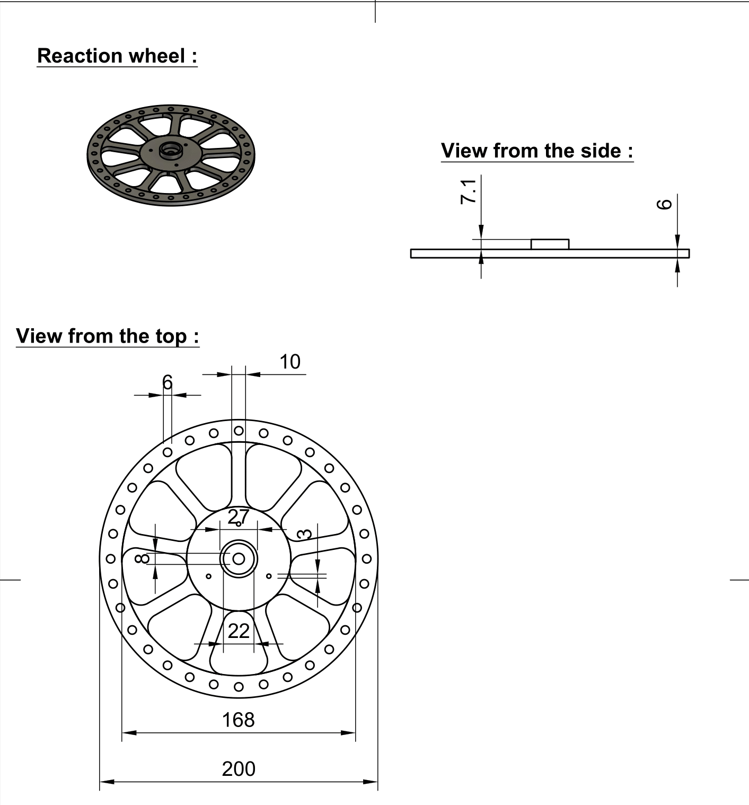

# **Manufacturing**

## **Preliminaries**

In this section you will find the informations related to the realisation of the 3D designs,the specification about the printing of our parts and the blueprints of the parts. For the designs we used **Fusion 360** and **Prusa 3D printers**. Note that every dimension reported on the blueprint are given in **milimeters (mm)**.

1. The reaction wheel and spacers
2. The theeted pulleys
3. The motor coupler
4. First prototype :
   1) Main plateform
   2) Motor shaft holder
   3) Motor pulley
   4) Reaction wheel holder
 
## **1. The reaction wheel and spacers**

* **The reaction wheel :** 

In order to achieve the maximum moment of inertia for the reaction wheel, our objective was to maximize the diameter of the wheel. Since the moment of inertia is the sum of the squared distances to the mass, the farther the mass is from the axis, the larger the moment will be. However, we faced a constraint due to the size of the printing bed of the printer we used for the distane to the axis.

Our experimentation demonstrated that a wheel with a thin design could easily break if the model were to fall. This is why the model we have implemented here is highly robust and should not break, provided it is used correctly in the application of this project. **Note that the reaction wheel has 32 holes for the screws used to add weight far from the axis.**

The most crucial aspect of printing this part is to use an appropriate perimeter setting. Increasing the perimeter setting enables us to reinforce the piece without significantly increasing the infill. It is essential for the holes where we will insert screws, nuts, and the location where the ball bearing will be placed to be sufficiently strong. This ensures that they do not break during rotation or when inserting the ball bearing. Here we used a perimeter of 4 and an infill of :

* **The ball bearing spacers :**

As you can observe in the section explaining the assembly of the model, we needed spacers with the same inner diameter as the ball bearing to ensure a good fit between the ball bearings.

The accompanying design picture, illustrates the dimensions of one of these spacers. **Please note that we used spacers of various sizes, but we are presenting only one blueprint as the only difference lies in the height of the spacers.**
//todo add the list of size of the spacer we use

* **The plates spacers :** 

In order to avoid that the belt hits the nuts from the reaction wheel while working, we needed spacer plates to increase the distance between the teethed pulley therefore we designed the spacing plates here bellow is the design and the dimensions of those spacers.

## **2. The teethed pulley**

We used GT-2 belts, which necessitated the design of GT-2 pulleys. To achieve this, we employed a functionality in **Fusion 360** that enabled us to create parametric designs of the pulleys. This approach facilitated the rapid design of the desired pulley variations and also facilitated testing different gear reduction options. The creation of this design is explained step by steps just bellow

The GT-2 pulley follows a specific standard for the teeth, which includes the pitch of the teeth on the pulleys and belts. Therefore, the parametric design of **the pulley size depend on the desired number of teeth**. In our specific application, the number of teeth required is determined by the desired gear reduction.

//todo : add parameter list with the explaination of what they correspond to for pulley
//todo : explain parameters explain step by step the creation of the parametric design 

For this particular printing, the most important setting to consider is the **precision**. Given that we are printing pulleys with small teeth, it is essential for the printing to be as accurate and precise as possible. Here we used the option : **10mm Quality** preset from **Prusa Slicer**. To prevent the belt to skip, we need plates to help the belt stay straight in on the pulley, here's the blueprint of thoses plates : 

## **3. Motor coupler**

For the motor coupler, we machined them using the tools available to us. This approach enabled us to create a high-quality coupler specifically designed for the motor we had. We were unable to find any suitable couplers for purchase online that could be delivered within a reasonable timeframe, which is why we resorted to machining our own. Here's the blueprint we created for this coupler

## **4. First prototype :** Support plate : 

As the first prototype purpose is to balance in one axis of freedom, we needed a plate where we could fit the motor, the ESC, the breadboard and the esp8266. For the first prototype we did all the tests without the batterie mounted.

## First prototype : reaction wheel older : 

## Sources of the images

