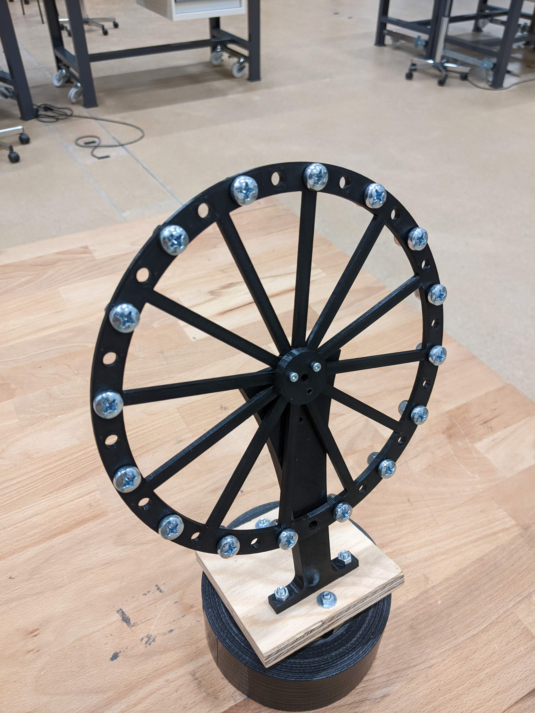
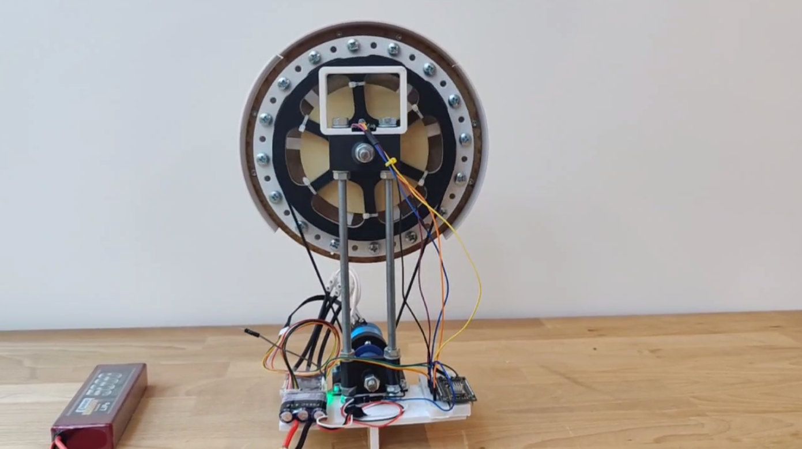
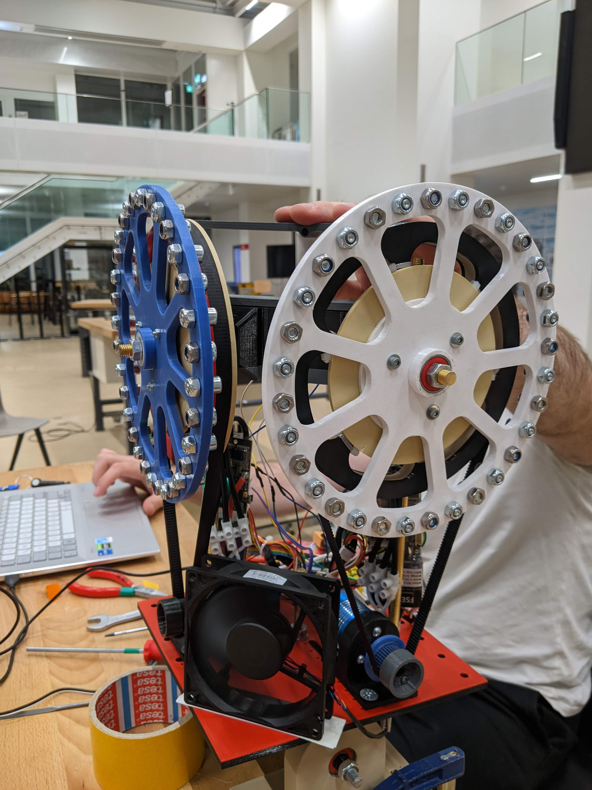
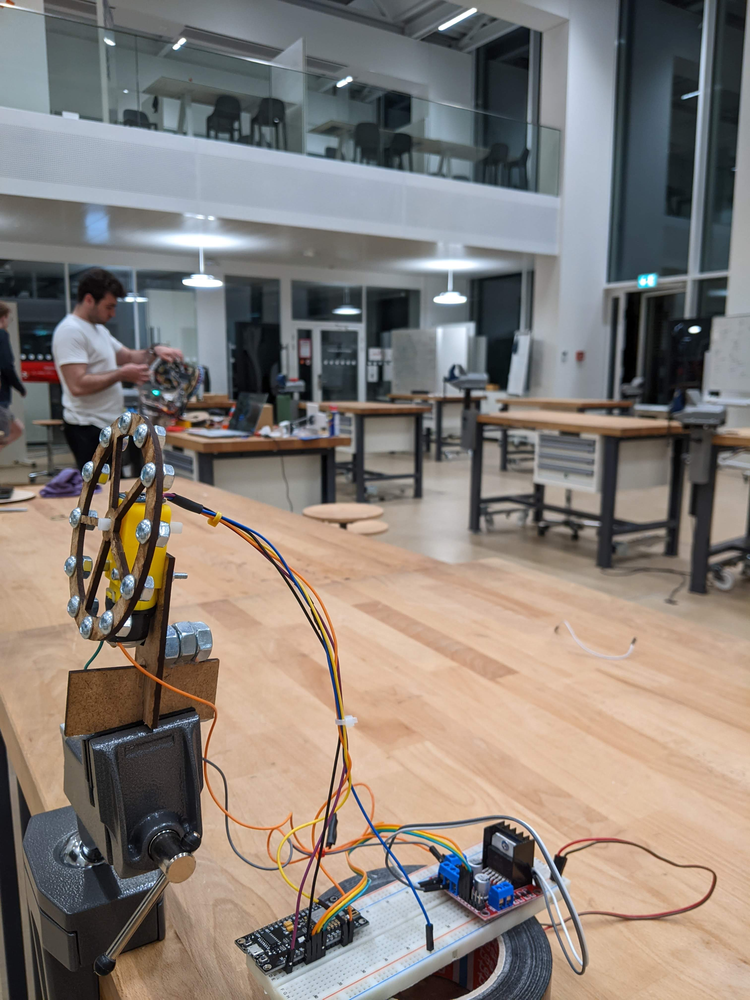

# Prototypes 

Throughout the process of designing the robot, we iterated through several prototypes until we got the final products. In this section, we will show some of the most important prototypes and briefly discuss them. 

## One Axis Balancing Robot v1 

This was the first prototype we did for the robot. Back then, we did not even have the final components, so we were testing with some components the professor, among them, a brushless DC motor and a generic ESC. 

## One Axis Balancing Robot v1

The design for this robot is the one we used for the final version of the one axis one. It consists of a motor mounted on the base, a small pulley attached to it, a bigger pulley on top and a toothed belt joining both. The design of the wheel is much sturdier and elegant. We tested many different reductions for the wheel until we settled with a 7 time reduction. After a small accident, we decided to add a protection for the wheel made out of MDF and 3D printed parts. It also has a handle on top to make it easier to hold it and to fix the MPU6050. 

## Two Axes Balancing Robot v1 

The design of this robot is quite similar to the before one, but using a bigger plate to hold two motors, ESCs and wheels. 

## Alternative Design 

A couple weeks before the deadline, while some team members worked on the One Axis v1, other team members decided to try a smaller version of the balancing robot. This version uses a small brushed motor with an integrated gear reduction, laser cut MDF body and wheel. Although it managed to stay balanced for a couple of seconds, this prototype was pretty rough and a better design should have been made to get it to properly work. However, while working on it, the other team members managed to make the One Axis v1 work. So, this was put aside.  