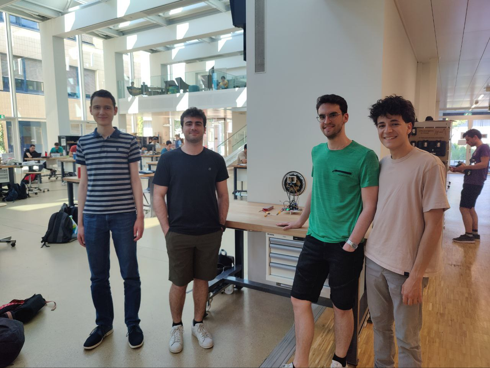
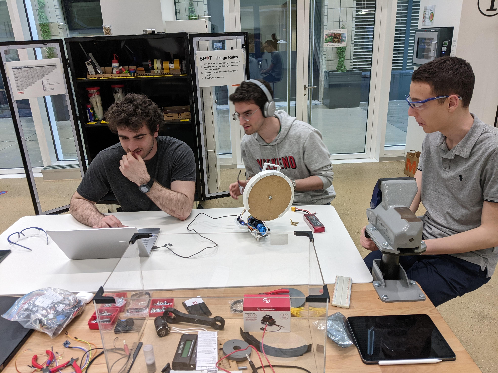
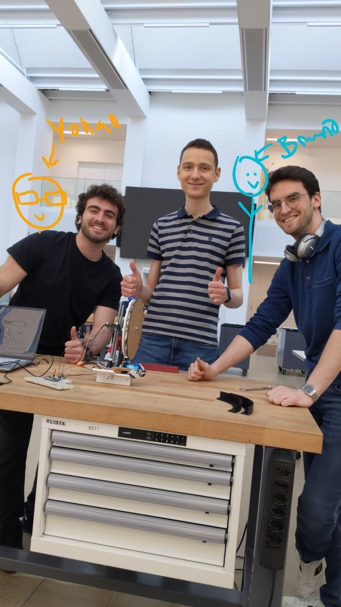

# Thanks

We want to warmly thanks Professor Christoph Koch, Federico Stella and the rest of the CS-358 TAs for the support and guidance they provided throughout the semester.  Also, many thanks to the staff of the SPOT. Without the help from all of this people, this project would have never come to fruition.

The Team being happy for the robot working just a few days before the deadline. 

----

The Team Working Hard 🤓

----

The Dream Team but incomplete