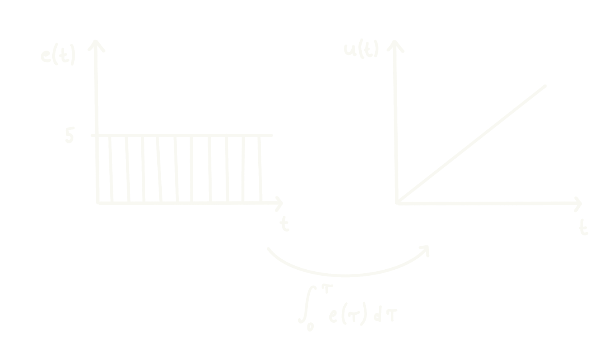
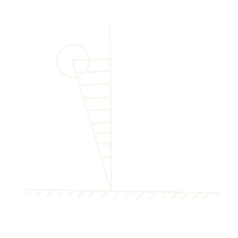

# Controller Explanation

To have a better ease of use and comprehension of the software, it is important to understand how the angular speed of the wheel is controlled. 

## PID Controller

To control the speed of rotation of the wheel, we use control loop called _Proportional-Integral-Derivative Controller_ or _PID Controller_ for short. In the image below, we can see an overview of this controller: 

 
- $r(t) =$ Setpoint (SP)
- $u(t) =$ Control Variable
- $y(t) =$ Process Variable
- $e(t) =$ Error Variable

Such a controller works in the following way. First, a _setpoint (SP)_ is chosen. The SP is the desired position that the robot should achieve. In our case, it would correspond to a small roll angle. If the angle is small, it means that the robot is in balance. Note that in an ideal world, the SP would be $0°$. However, since the weight of the robot is not perfectly distributed, the $r(t) \in [-5^{\circ}, 5^{\circ}]$. Later, we will also explain how and why we must adjust the SP dynamically to achieve greater stability.

Then, the controller computes the _error variable_:

$$e(t) = r(t) - y(t)$$

The error represents how "far" the robot is to the SP. After that, the error variable is passed through three different channels: _proportional (P), integral (I) and derivative (D)_. Each channel possess a so-called _gain_: $K_{p}$, $K_{i}$ and $K_{d}$ respectively. These gains are constants defined by the user of the PID controller to determine the effect or "weight" of each channel on the control variable $u(t)$. By doing so, the desired behavior is achieved (see the [Tuning Guide](../software/tuning.md)).

In the P channel, the error variable is simply multiplied by the constant $K_{p}$. In the I channel, the error is integrated w.r.t. time and then multiplied by $K_{i}$. Finally, in the D channel, the error is derived w.r.t. time and then multiplied by $K_{d}$. Thus, the _control variable_ can be expressed as: 

$$u(t) = K_\text{p} e(t) + K_\text{i} \int_0^t e(\tau) \,\mathrm{d}\tau + K_\text{d} \frac{\mathrm{d}e(t)}{\mathrm{d}t}$$

The control variable is then fed to the motor in the form of a PWM signal or the RPM at which it should spin. Finally, the _process variable_ $y(t)$, in our case, the newly measured angle, is fed back and the new error variable $e(t)$ is computed. Then, the loop begins again. 

## Understanding the Effect of Each Channel

Let us examine the effect of each channel to understand how they may help us to achieve a robot that balances itself. 

Suppose that we are only using the **proportional path**, that is $K_{i}$ and $K_{d}$ are set to zero: 

$$u(t) = K_{p}e(t)$$

Suppose too that the motor must accelerate to a speed of **100 RPM** to counteract the torque exerted by gravity on the robot. Then, by increasing the $K_{p}$, we can decrease the error: 

| Error $e(t)$ | Gain $K_{p}$ | RPM $u(t)$          |
|--------------|--------------|---------------------|
| 50           | 2            | 100                 |
| 20           | 5            | 100                 |
| 10           | 10           | 100                 |
| 1            | 100          | 100                 |

On a first glance, this seems enough. However, looking closely, we notice that no matter how big the $K_{p}$ is set to, there will always be a small error. This particular type of error is often called _steady state error_, and it is the **integral channel purpose** to eliminate.

Let us suppose that we set $K_{p} = 20$ and we reduced the error to $e(t) = 5^{\circ}$:

Although the motor is already spinning at 100 RPM, the error $e(t)$ has not yet been reduced to $0^{\circ}$. This is where the **integral channel** comes in. 

Suppose now that the motor holds its position for a few milliseconds with an error of $e(t) = 5^{\circ}$. The integral channel will integrate this constant error w.r.t time and continue adding to the control variable $u(t)$. Thus, the integral channel finishes correcting any error that the proportional channel did not correct. 

Sometimes, it can happen that although the robot is very close to the SP, the integrator still has a positive value. In order to decrease this value, it must overshoot beyond the SP to generate a negative error. 

This causes oscillations on the robot, since it needs to constantly overshoot to reduce the integral term. Hence, the final channel comes into play: the **derivative channel**. 

As the name suggests, the channel derives the error w.r.t time. Thus, the controller gains some insight on the _rate of change_ of the error and is then able to "predict" the motion of the robot. 

As the robot approaches the SP, the error decreases and the derivative is then negative. Therefore, when adding all of the channels together, the derivative term will counteract the other channels to adjust the rotational speed in advance. 

In brief, the proportional channel will try to close the gap between the SP and the current position; the integral channel will fix the error that the proportional did not manage to; and finally, the derivative path will counterbalance the other two to help it stabilize faster. In conjunction, the three channels work together to keep the robot in balance. 
