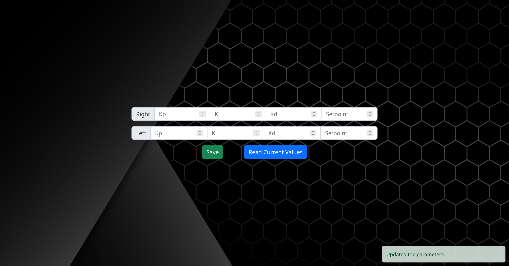

#Web app
We built a web app that would act as a tool to rapidly try new PID gains and change the setpoint, by sending them to the Arduino via an MQTT broker. 
It can be found <a href="http://34.65.54.86:8080/" target="_blank" rel="noopener noreferrer">here</a> 

We can read the current values, flash new ones, change them easily with a scroll wheel at different increments and get confirmation when they are updated.  
Is is built with Vue and Nodejs, and is hosted on our server, so it can be accessed easily, but can be run locally. 

Github repo: <a href="https://github.com/mit-unicycle/web_app">mit-unicycle/web_app</a>